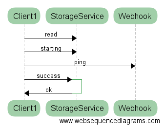
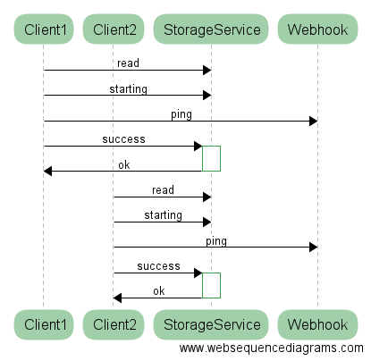
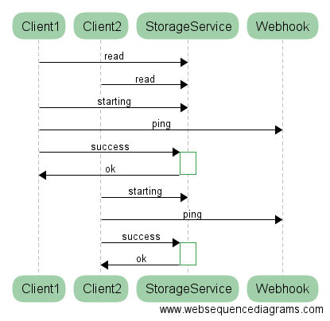
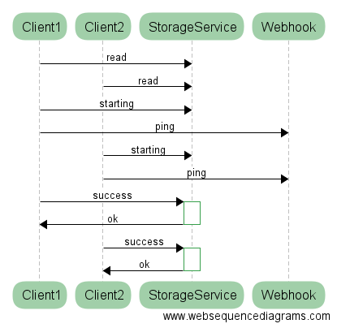
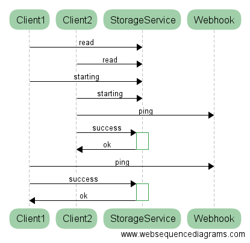
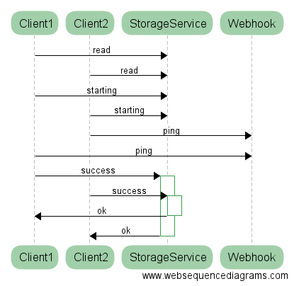

# Locks and Leaders with Spring Integration

Dave Syer, 2016  
Twitter: @david_syer (see also @artem_bilan, @gprussell)  
Email: `dsyer@pivotal.io`

## Agenda

* What is a distributed lock?
* What is a leader election?
* What is it good for?
* How do I do it?
* Some tools for thinking about failure


> Warning: Here be Dragons!

## A Simple Distributed Operation



## Two Clients



## Shuffle!



## Shuffle!



## Shuffle!



## Shuffle!


## Shuffle!


## Shuffle!


## Scary, Eh?



## Locks

Example code using `java.util.concurrent.locks.Lock`:

```java
boolean acquired = false;
try {
  acquired = lock.tryLock(10, TimeUnit.SECONDS);
  if (acquired) {
    // Do something unique!
  }
} catch (InterruptedException e) {
  Thread.currentThread().interrupt();
  throw new RuntimeException("Interrupted");
} finally {
  if (acquired) {
    lock.unlock();
  }
}
```


## Spring Integration: LockRegistry

```java
public interface LockRegistry {
	Lock obtain(Object lockKey);
}
```

## Locks with Spring Integration

Example code using `LockRegistry`:

```java
boolean acquired = false;
try {
  acquired = lock.tryLock(10, TimeUnit.SECONDS);
  if (acquired) {
    // Do something unique!
  }
} catch (InterruptedException e) {
  Thread.currentThread().interrupt();
  throw new RuntimeException("Interrupted");
} finally {
  if (acquired) {
    lock.unlock();
  }
}
```

(same code)

## Locks and Leases

A distributed lock nearly always has a shelf life (it expires).

Technically, that makes it a "lease".

Without expiry system can't make progress when a lock holder dies.

## Dragons

(At least) two problems are lurking:

1. Acquiring a lock requires consensus.
2. Leases expire and holder can never be sure when that happens.

**Read this**:
  [http://martin.kleppmann.com/2016/02/08/how-to-do-distributed-locking.html](http://martin.kleppmann.com/2016/02/08/how-to-do-distributed-locking.html)

TL;DR If using a lock for "correctness" not "efficiency" be *very* careful.

## Public Service Announcement

> Important: you can tune the system to adjust the probability, or how
> long it lasts, but fundamentally you cannot prevent the system from
> ever allowing more than one holder of a lock.

## Leader Elections

> Simple idea: if you hold a lock you are the leader.

What can you do with it?

> Highly available globally unique things, often with messages

* sequences
* message aggregation
* scheduling, e.g. cron service

## Spring Integration: Leader Initiator

Implementations of leader election need to be able to start an
election and fire events on granted and revoked.

* Zookeeper
* Hazelcast
* Etcd(*)
* Generic (lock-based)

For a user it looks like this (create a new bean which is a `SmartLifecycle`):

```java
@Bean
public LeaderInitiator leaderInitiator(CuratorFramework client,
			Candidate candidate) {
  return new LeaderInitiator(client, candidate);
}
```

(*) No support for etcd v3. Probably dead.

## Spring Integration: Callbacks

Callbacks on leadership events:

```java
public interface Candidate {
	void onGranted(Context ctx) throws InterruptedException;
	void onRevoked(Context ctx);
    ...
}
```

See also:

```java
@EventListener(OnGrantedEvent.class)
public void start() {

}

@EventListener(OnRevokedEvent.class)
public void stop() {

}
```

## Closing

* When to use locks and leaders: HA active/passive failover

* How to avoid it: latency from restarting a failed app might be fine

* Otherwise, be idempotent. For correctness, de-duplication store has to be ACID.

* Relational databases can be really useful, as is Zookeeper.

* Careful with the physics.

## Links

* http://presos.dsyer.com/decks/locks-and-leaders.html
* Sample code: [https://github.com/SpringOnePlatform2016/dsyer-locks-and-leaders](https://github.com/SpringOnePlatform2016/dsyer-locks-and-leaders)
* Spring Integration: [https://github.com/spring-projects/spring-integration](https://github.com/spring-projects/spring-integration)
* Spring Cloud Cluster: [https://github.com/spring-cloud/spring-cloud-cluster](https://github.com/spring-cloud/spring-cloud-cluster)

