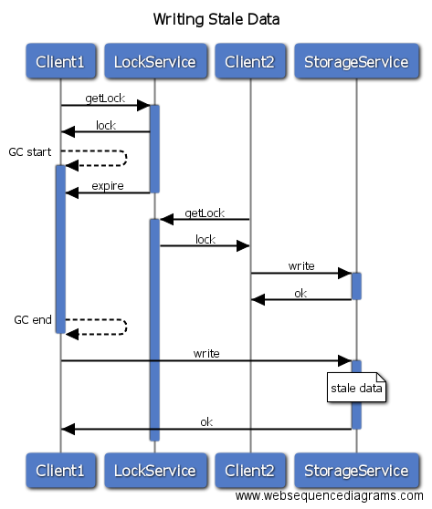
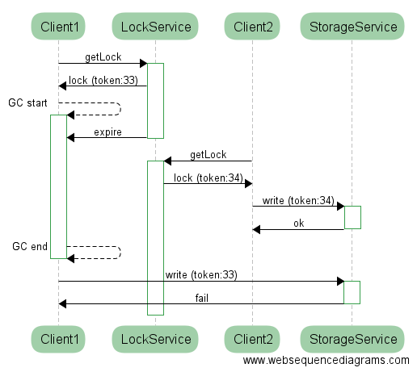
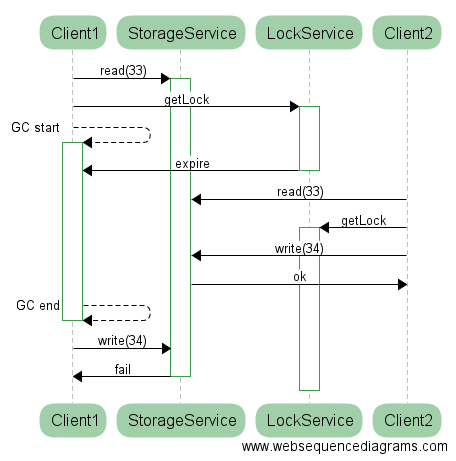

# Locks and Leaders with Spring Integration

Dave Syer, 2016  
Twitter: @david_syer  
Email: `dsyer@pivotal.io`

## Agenda

* What is a distributed lock?
* What is a leader election?
* What is it good for?
* How do I do it?
* Some tools for thinking about failure


> Warning: Here be Dragons!

## A Simple Distributed Operation


## Two Clients


## Shuffle!


## Shuffle!


## Shuffle!


## Shuffle!


## Shuffle!


## Shuffle!


## Scary, Eh?


## Locks

Example code using `java.util.concurrent.locks.Lock`:

```java
boolean acquired = false;
try {
  acquired = lock.tryLock(10, TimeUnit.SECONDS);
  if (acquired) {
    // Do something unique!
  }
} catch (InterruptedException e) {
  Thread.currentThread().interrupt();
  throw new RuntimeException("Interrupted");
} finally {
  if (acquired) {
    lock.unlock();
  }
}
```


## Spring Integration: LockRegistry

```java
public interface LockRegistry {
	Lock obtain(Object lockKey);
}
```

## Locks with Spring Integration

Example code using `LockRegistry`:

```java
boolean acquired = false;
try {
  acquired = lock.tryLock(10, TimeUnit.SECONDS);
  if (acquired) {
    // Do something unique!
  }
} catch (InterruptedException e) {
  Thread.currentThread().interrupt();
  throw new RuntimeException("Interrupted");
} finally {
  if (acquired) {
    lock.unlock();
  }
}
```

(same code)

## Locks and Leases

A distributed lock nearly almost has a shelf life (it expires).

Technically, that makes it a "lease".

You need the expiry in order to make progress when a lock holder dies.

## Gotcha

```java
...
  if (acquired) {
    // Don't assume only one process can do this
  }
...
```

All threads/processes are competing for the lock. If one
drops it, accidentally or on purpose, another will grab it.

> Tip: You need to guard the work inside the lock to make
> it idempotent anyway. (More later...)

## Dragons

(At least) two problems are lurking:

1. Acquiring a lock requires consensus.
2. Leases expire and holder can never be sure when that happens.

**Read this**:
  [http://martin.kleppmann.com/2016/02/08/how-to-do-distributed-locking.html](http://martin.kleppmann.com/2016/02/08/how-to-do-distributed-locking.html)

## What?

```java
...
  if (acquired) {
    // Who is watching? How do they let you know
    // if a lock expires?
  }
...
```

The lock has to be a shared resource across multiple processes.  Laws
of physics prevent the lock holder from being immediately aware of a
lock being broken, even supposing he is able to detect it.

> Important: you can tune the system to adjust the probability, or how
> long it lasts, but fundamentally you cannot prevent the system from
> ever allowing more than one holder of a lock.

## Leader Elections

> Simple idea: if you hold a lock you are the leader.

What can you do with it?

> Highly available globally unique things, often with messages

* sequences
* message aggregation
* webhooks
* cron service

## Spring Integration: Leader Initiator

Implementations of leader election need to be able to start an
election and fire events on granted and revoked.

* Zookeeper
* Hazelcast
* Etcd
* Generic (lock-based)

For a user it looks like this (create a new bean which is a `SmartLifecycle`):

```java
@Bean
public LeaderInitiator leaderInitiator(CuratorFramework client,
			Candidate candidate) {
  return new LeaderInitiator(client, candidate);
}
```

## Spring Integration: Callbacks

Callbacks on leadership events:

```java
public interface Candidate {
	void onGranted(Context ctx) throws InterruptedException;
	void onRevoked(Context ctx);
    ...
}
```

See also:

```java
@EventListener(OnGrantedEvent.class)
public void start() {

}

@EventListener(OnRevokedEvent.class)
public void stop() {

}
```

## Wrap Up

* When to use locks and leaders: HA active/passive failover

* How to avoid it: latency from restarting a failed app might be fine

* Otherwise, be idempotent. For correctness, de-duplication store has to be ACID.

* Relational databases are really useful.

## Summary

* Locks can be shared and distributed
* Leader election is an application of locks
* Spring Integration has some useful abstractions: [https://github.com/spring-projects/spring-integration](https://github.com/spring-projects/spring-integration)
* Careful with the physics
* Sample code: [https://github.com/SpringOnePlatform2016/dsyer-locks-and-leaders](https://github.com/SpringOnePlatform2016/dsyer-locks-and-leaders)
* Spring Cloud Cluster: [https://github.com/spring-cloud/spring-cloud-cluster](https://github.com/spring-cloud/spring-cloud-cluster)

## Links

Optimistic Locks fencing and ping:

[Client1 Wins](https://www.websequencediagrams.com/?lz=CkNsaWVudDEtPlN0b3JhZ2VTZXJ2aWNlOiByZWFkKDMzKQAbBzIAASEyLT4rADUQc3RhcnRpbmcoMzQpCgBUDi0-LQBTBzogb2sAXApXZWJob29rOiBwaW5nAD8cdWNjZXNzADIoMQBnNzE6IGZhaWwKZGVzdHJveSAAgikHCgo&s=roundgreen)

[CLient2 Wins](https://www.websequencediagrams.com/?lz=CkNsaWVudDEtPlN0b3JhZ2VTZXJ2aWNlOiByZWFkKDMzKQAbBzIAASExLT4rADUQc3RhcnRpbmcoMzQpCgBUDi0-LQB1Bzogb2sAfgpXZWJob29rOiBwaW5nAD8cdWNjZXNzADIoMgBnNzI6IGZhaWwKZGVzdHJveSAAggcHCg&s=roundgreen)

[Oops](https://www.websequencediagrams.com/?lz=CkNsaWVudDEtPlN0b3JhZ2VTZXJ2aWNlOiByZWFkKDMzKQAYCisAExBzdGFydGluZygzNCkKADIOLT4tAFMHOiBvawBfBzIAThg0KQpub3RlIHJpZ2h0IG9mIAApBzogcmVzdWx0IG5vdCByZWNvcmRlZApkZXN0cm95AB0IAIE5CldlYmhvb2s6IHBpbmcAgRwcdWNjZXNzAIEVIg&s=roundgreen)

## Writing Stale Data



## Fencing

```java
MyData data = getDataIncludingVersion();
...
  if (acquired) {
    checkVersion(data); // Throw exception here if someone else updated the data
    update(data);
  }
...
```

N.B. The version is not necessarily part of the lock; it's stored and
checked in the shared resource that needs to be updated.

## Fencing a Lock

From Martin Kleppmann:



> BUT: The storage service has to be fully consistent.

## Alternative View



> BUT: Now the storage service has to have isolation guarantees as
> well (ACID).

