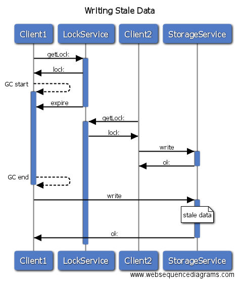
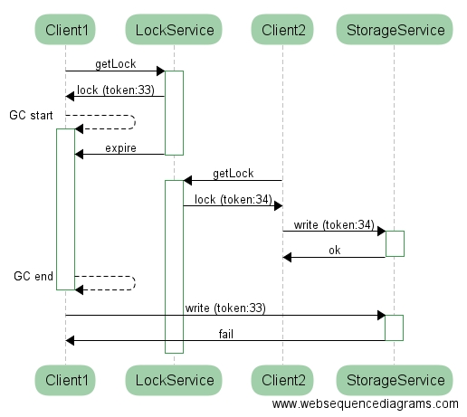
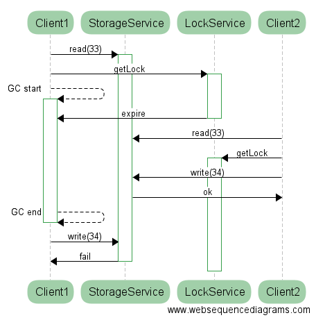

## Links

Optimistic Locks fencing and ping:

[Client1 Wins](https://www.websequencediagrams.com/?lz=CkNsaWVudDEtPlN0b3JhZ2VTZXJ2aWNlOiByZWFkKDMzKQAbBzIAASEyLT4rADUQc3RhcnRpbmcoMzQpCgBUDi0-LQBTBzogb2sAXApXZWJob29rOiBwaW5nAD8cdWNjZXNzADIoMQBnNzE6IGZhaWwKZGVzdHJveSAAgikHCgo&s=roundgreen)

[CLient2 Wins](https://www.websequencediagrams.com/?lz=CkNsaWVudDEtPlN0b3JhZ2VTZXJ2aWNlOiByZWFkKDMzKQAbBzIAASExLT4rADUQc3RhcnRpbmcoMzQpCgBUDi0-LQB1Bzogb2sAfgpXZWJob29rOiBwaW5nAD8cdWNjZXNzADIoMgBnNzI6IGZhaWwKZGVzdHJveSAAggcHCg&s=roundgreen)

[Oops](https://www.websequencediagrams.com/?lz=CkNsaWVudDEtPlN0b3JhZ2VTZXJ2aWNlOiByZWFkKDMzKQAYCisAExBzdGFydGluZygzNCkKADIOLT4tAFMHOiBvawBfBzIAThg0KQpub3RlIHJpZ2h0IG9mIAApBzogcmVzdWx0IG5vdCByZWNvcmRlZApkZXN0cm95AB0IAIE5CldlYmhvb2s6IHBpbmcAgRwcdWNjZXNzAIEVIg&s=roundgreen)

## Gotcha

```java
...
  if (acquired) {
    // Don't assume only one process can do this
  }
...
```

All threads/processes are competing for the lock. If one
drops it, accidentally or on purpose, another will grab it.

> Tip: You need to guard the work inside the lock to make
> it idempotent anyway. (More later...)

## What?

```java
...
  if (acquired) {
    // Who is watching? How do they let you know
    // if a lock expires?
  }
...
```

The lock has to be a shared resource across multiple processes.  Laws
of physics prevent the lock holder from being immediately aware of a
lock being broken, even supposing he is able to detect it.

## Writing Stale Data



## Fencing

```java
MyData data = getDataIncludingVersion();
...
  if (acquired) {
    checkVersion(data); // Throw exception here if someone else updated the data
    update(data);
  }
...
```

N.B. The version is not necessarily part of the lock; it's stored and
checked in the shared resource that needs to be updated.

## Fencing a Lock

From Martin Kleppmann:



> BUT: The storage service has to be fully consistent.

## Alternative View



> BUT: Now the storage service has to have isolation guarantees as
> well (ACID).

